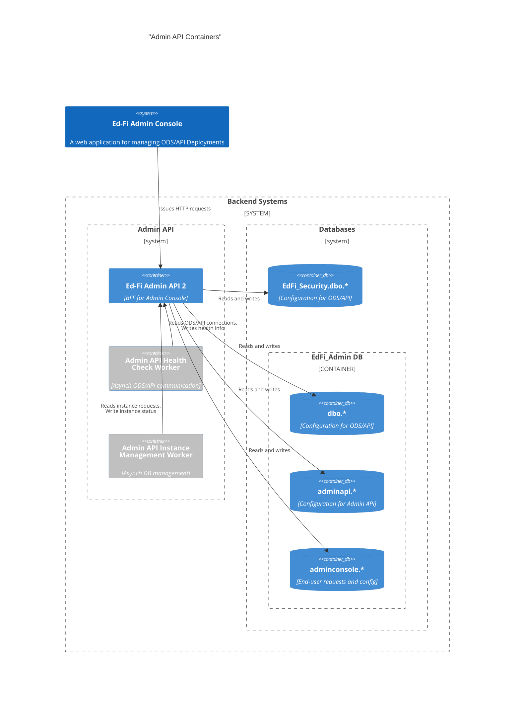

# REST API Support for Admin Console

This document describes the new interfaces and data storage requirements to be
fulfilled directly in the Ed-Fi ODS/API Admin API 2 application, in support of
the Ed-Fi Admin Console.

## System Context

## Solution Design

We are going to expose the Admin Console endpoints required for the application
in Admin API. It will be hosted as a different definition in Swagger and the
base path  `/adminconsole/{resource}`.

All new endpoints will utilize standard HTTP verbs and response codes. The notes
below only describe unusual circumstances that differ from default values. This
table summarizes the new endpoints, which are described in more detail below.

| Resource      | Purpose                                                                     | Priority |
| ------------- | --------------------------------------------------------------------------- | -------- |
| `instances`   | Supports the end user's need to list and initiate creation of new Instances | High     |
| `tenants`     | Supports listing and creation of new tenants                                | Medium   |
| `steps`       | Manages onboarding wizard steps                                             | Low      |
| `permissions` | Configures application permissions for a user                               | Low      |
| `userProfile` | Manages user information                                                    | Low      |

### Resources

#### Instances

The Admin Console will issue HTTP requests to:

1. List both existing Instances and newly requested instances. An instance
   therefore has a status. Statuses will include:
   * `Pending` - ODS database has not yet been created.
   * `Creating` - This state will only be available in a future release, when the
     [Instance Management Worker](./INSTANCE-MANAGEMENT.md) has a job locking
     mechanism.
   * `Active` - ODS database has been created and is functional.
   * `Error` - Some error occurred during database creation.

   > [!NOTE]
   > The actual terms for status may need to change based on what Admin Console
   > is already written to accept. These are preliminary names only.

2. Create new instances. In reality, this is a _request to create an instance_,
   which will be fulfilled by the [Instance Management
   Worker](./INSTANCE-MANAGEMENT.md).

At this time there is no need to edit or delete instances.

The Instance Management Worker will also use this endpoint to retrieve
information on the instances that it needs to create, and write additional
information back to the system. The Worker will need to process secure
information that should not be seen by an end user - for example, client
credentials to support the [Health Check Worker](./HEALTH-CHECK-WORKER.md). For
this reason, _the resource needs to differentiate the client role when
authorizing access_.

Detailed functionality is listed below. The "Role" column refers to role-base
authorization to perform the actions. An authenticated client that tries to
access an endpoint that is not allowed by their role should receive a 403
Forbidden response.

| HTTP Request                             | Action                                                   | Auth Role    |
| ---------------------------------------- | -------------------------------------------------------- | ------------ |
| `GET /adminconsole/instances`            | Retrieves a page of instances without secure information | Any          |
| `GET /adminconsole/instances/{id}`       | Retrieves a specific instance without secure information | Any          |
| `GET /adminconsole/instances/pending`    | Retrieves all instances with pending state               | InstanceMgmt |
| `POST /adminconsole/instances/{id}/done` | Marks the instance as active and creates new credentials | InstanceMgmt |

The work performed by the `/done` endpoint is described in detail in [Health Check Worker](./HEALTH-CHECK-WORKER.md#admin-apis-responsibilities).

#### Tenants

Placeholder for future design. At this time, tenants are defined in the App Settings file.

#### Steps

Placeholder for future design. This work is on hold.

#### Permissions

Placeholder for future design. This work is on hold.

#### UserProfile

Placeholder for future design. This work is on hold.

### Persistence

Tables will be created under the new schema called `adminconsole` in the
`EdFi_Admin` database. Tables will have the following design:

* Doc ID - integer/PK
* OdsInstanceId - integer or UUID
* EdOrgID - integer (optional)
* UserID - integer (optional)
* Document - JSONB

We identify the following tables to be created:

* `Instances`
* `Permissions` - on hold
* `Steps` - on hold
* `Tenants` - on hold
* `UserProfile` - on hold

Some of these examples contain sensitive data such as keys and secrets values, so we are thinking of using an encryption/decryption mechanism to store the JSONB data by means of an AES256 algorithm same as we use in the ODS/API application.

## Mock Data

placeholder
