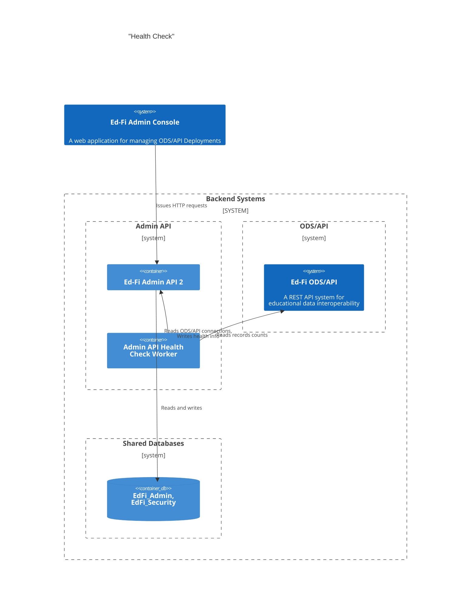

# Health Check Worker

This document describes the work performed by the Admin API 2 application and
its associated Health Check Worker for retrieving and storing record counts from
the ODS/API.

## Context



## Solution Design

### ODS/API Credentials

The worker needs client credentials (also known as "key and secret") for
accessing each ODS Instance via the API. These credentials need to use their own
read only claimset providing access to all queries resources, using
`NoFurtherAuthorizationStrategy`. By implication then, the system must create
records in the following tables:

1. `dbo.Vendor` creating an "Ed-Fi Administrative Tools" vendor with namespace
   `uri://ed-fi.org`.
2. `dbo.Applications` creating an "Ed-Fi Health Check" application.
3. A new `dbo.ApiClients` and `dbo.ApiClientOdsInstances` record for each ODS
   Instance. NOTE: while it is possible to associate a single `ApiClient` with
   multiple `OdsInstances`, we prefer having a one-to-one relationship.

#### Admin API's Responsibilities

Managing these tables is Admin API 2's responsibility, not the health check
worker's responsibility.

During deployment, Admin API 2 should:

1. Create the vendor and application records.
2. Create the readonly claimset.

At application startup, and each time a new instance is created, Admin API 2
should:

1. Create the necessary `ApiClients` adn `ApiClientOdsInsances` records for the
   health check worker, and
2. Synchronize any existing information from `dbo.odsInstances` and related
   tables into Admin API's `Instances` table. This includes storing the
   credentials from step 1 into the `Instances` table.

> [!TIP]
> To the extent possible, this work should use the existing Admin API 2
> application code for managing these tables.

#### Encryption and Storage of Credentials

The stored credentials must be encrypted at rest. When an Admin Console user
wants to review the status of the instances, the Admin Console application will
retrieve the instance information from Admin API 2 via `GET
/adminconsole/instances`. This request _must not_ contain the encrypted
credentials. The data used by the Admin Console are stored as a JSON object in
the `Document` column. The credentials should be stored in a new column:

1. It is easier to avoid returning this information to the Admin Console since
   it does not need to be removed from the `document` body.
2. Minimizing the amount of encrypted information will aid in application
   debugging.

Suggestion: add a new column `Credentials` of type string. Continue using JSON
storage, encrypting a string like the following:

```json
{
    "client_id": "abcdedf",
    "client_secret": "1232142"
}
```

The encryption can utilize the same key that Admin API 2 uses for encrypting
connection strings in `dbo.OdsInstances`.

### Reading ODS/API Record Counts

placeholder

### Storing Record Counts

placeholder
