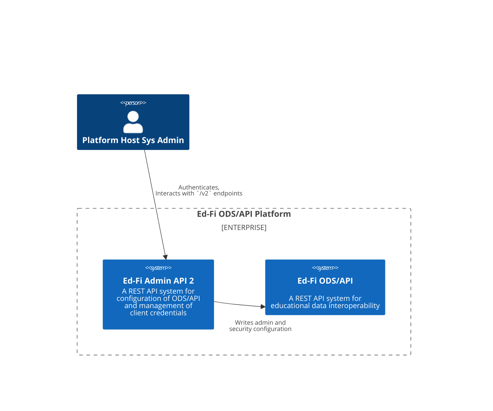
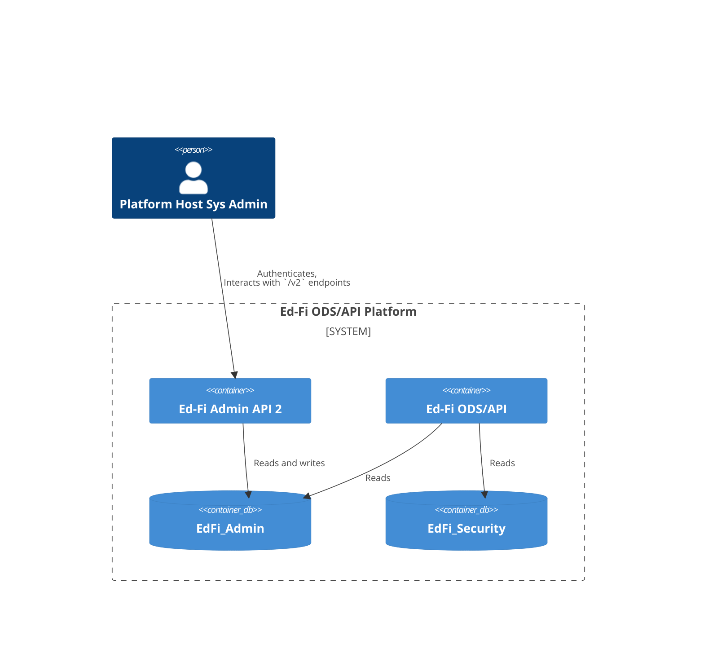
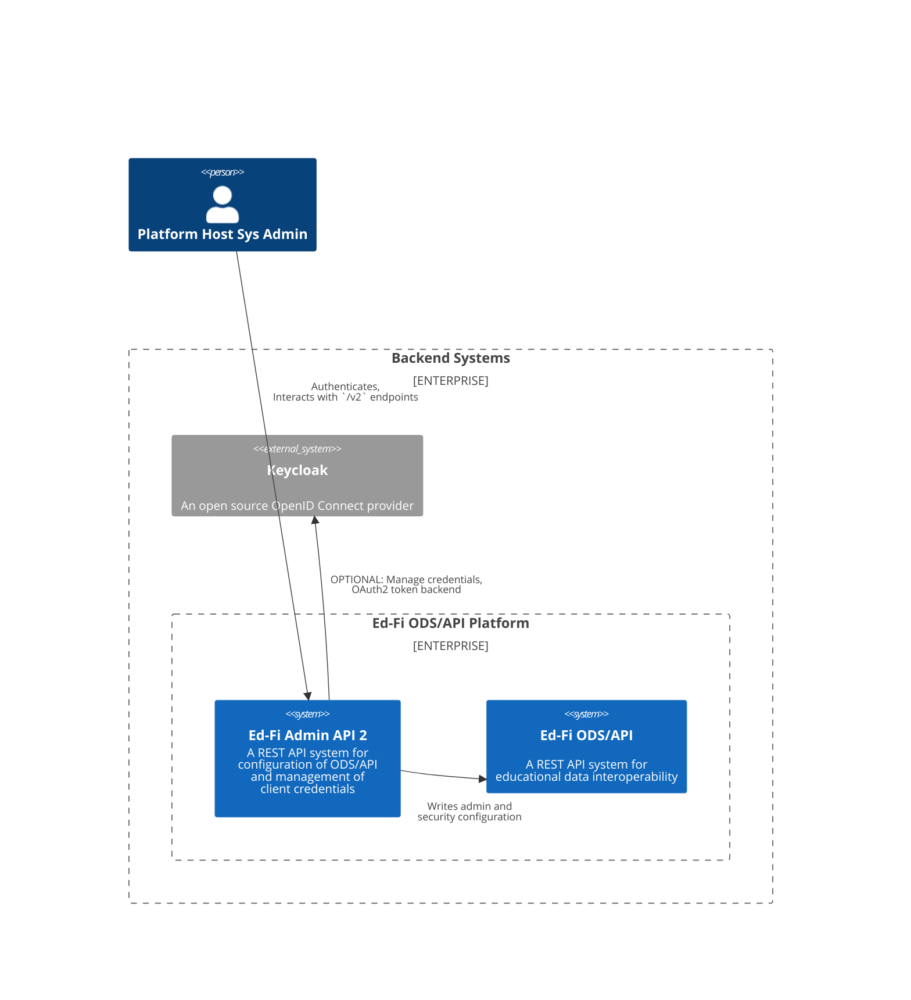
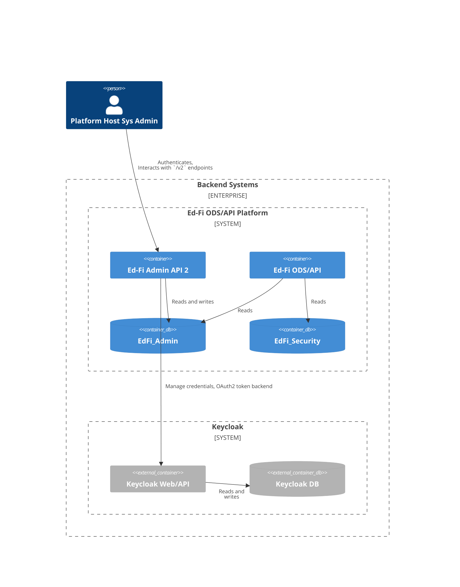

# Authentication and Authorization in Admin API 2.x

## Versions 2.0, 2.1, and 2.2

### System Context 2.0 through 2.2

System administrators interact directly with Admin API to perform ODS/API
configuration tasks and manage client credentials.

### Containers 2.0 through 2.2

## Version 2.3 and above

Beginning with version 2.3, deployments will have the option of using
[Keycloak](https://www.keycloak.org/) as an external OAuth provider. This will
be _required_ when using [Admin Console](../adminconsole/readme.md). For
backwards compatibility, existing Admin API users will be able to continue
direct integrations without needing Keycloak.

### System Context 2.3+

Keycloak is an optional part of the system.

### System Containers 2.3+

The containers can look exactly as in Admin API 2.0 through 2.2, or alternately:

## Solution Design

* [Self-Contained Authentication with OpenIdDict](./SELF-CONTAINED.md)
* [Keycloak Integration](./KEYCLOAK.md)
