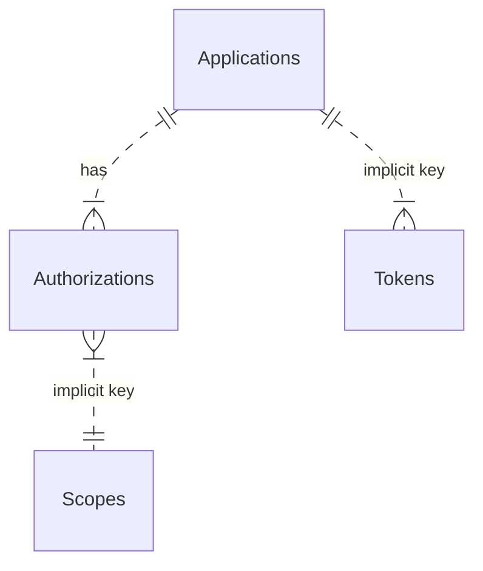

# Self-Contained Authentication with OpenIdDict

## Overview

Admin API 1 and Admin API 2 have built in support for the OAuth
`client_credentials` grant flow, allowing people (system administrators) or
other systems to interact with the application via the `/connect/token`
endpoint. Put another way: there is no need to provision a third party Identity
Provider (IdP). Admin API serves as its own IdP.

Client credentials are created via the `/connect/register` endpoint following a
custom protocol.

> [!NOTE]
> Neither OAuth 2 nor OpenID Connect prescribe the interface for creating and
> managing credentials.

## Implementation

Admin API integrates [OpenIdDict](https://openiddict.com/) directly into its own
application source code.

This integration uses the following database tables:

"implicit key" in this diagram means that there is no foreign key relationship
in the database.

> [!NOTE]
> The author does not know why there is no foreign key, but presumably it is for
> a good reason.
